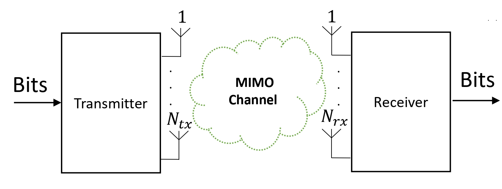
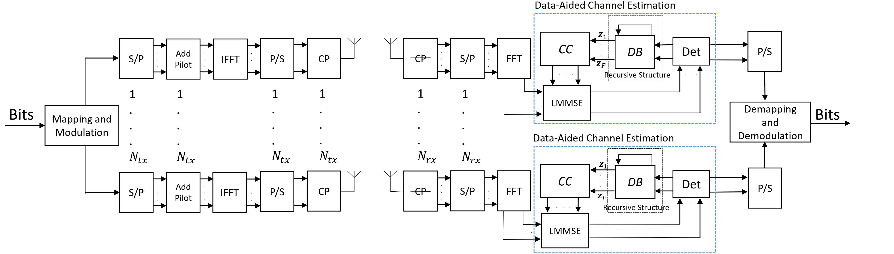
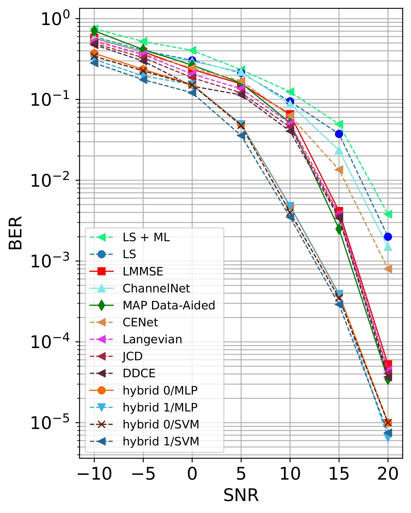
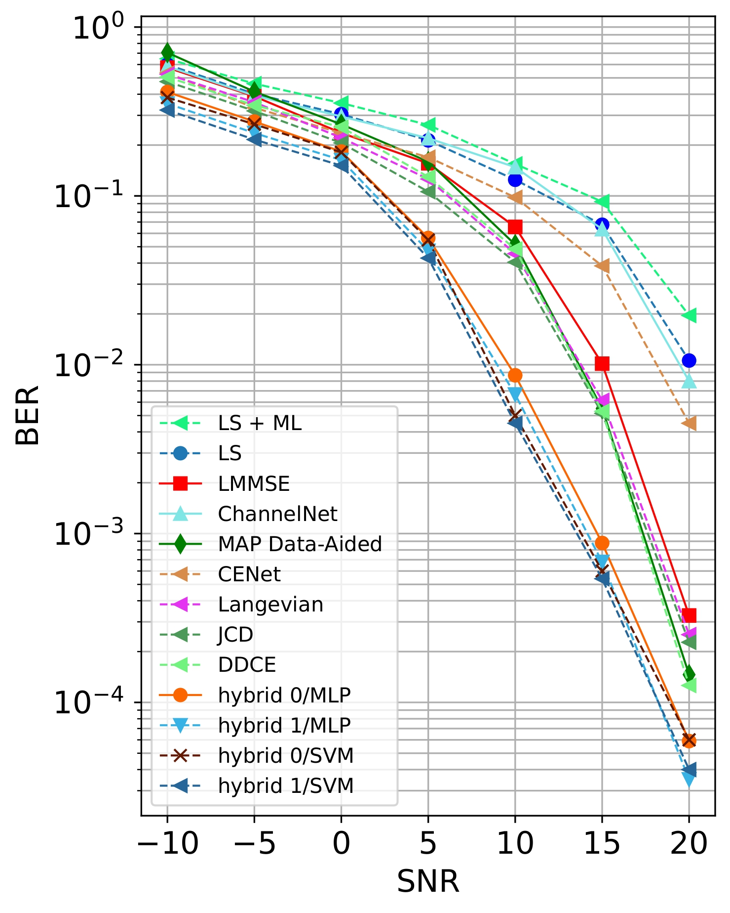
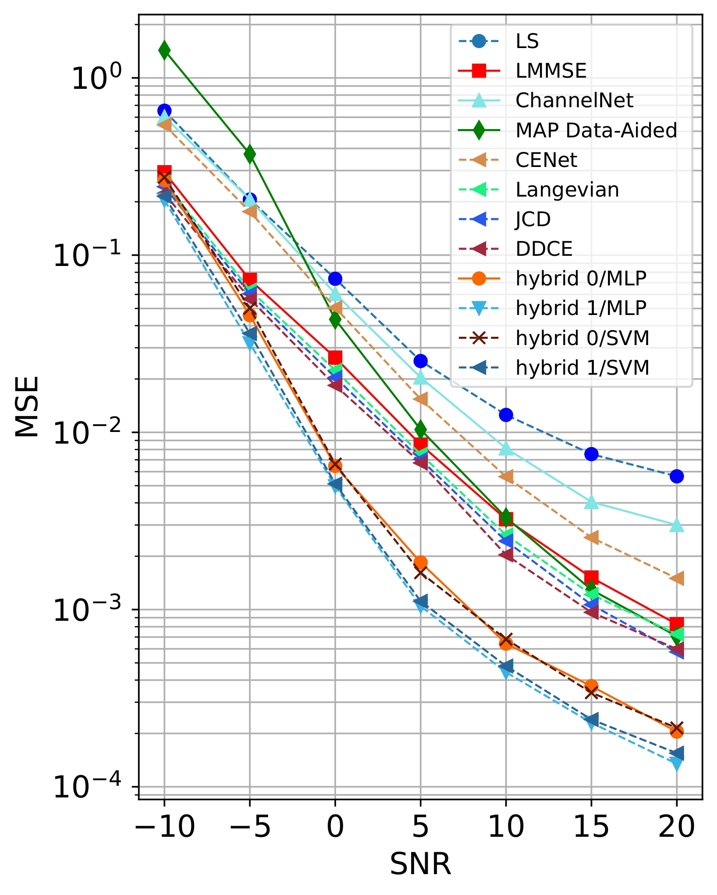
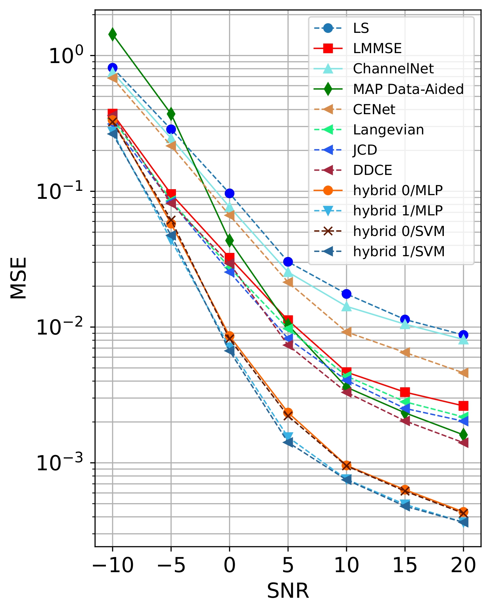
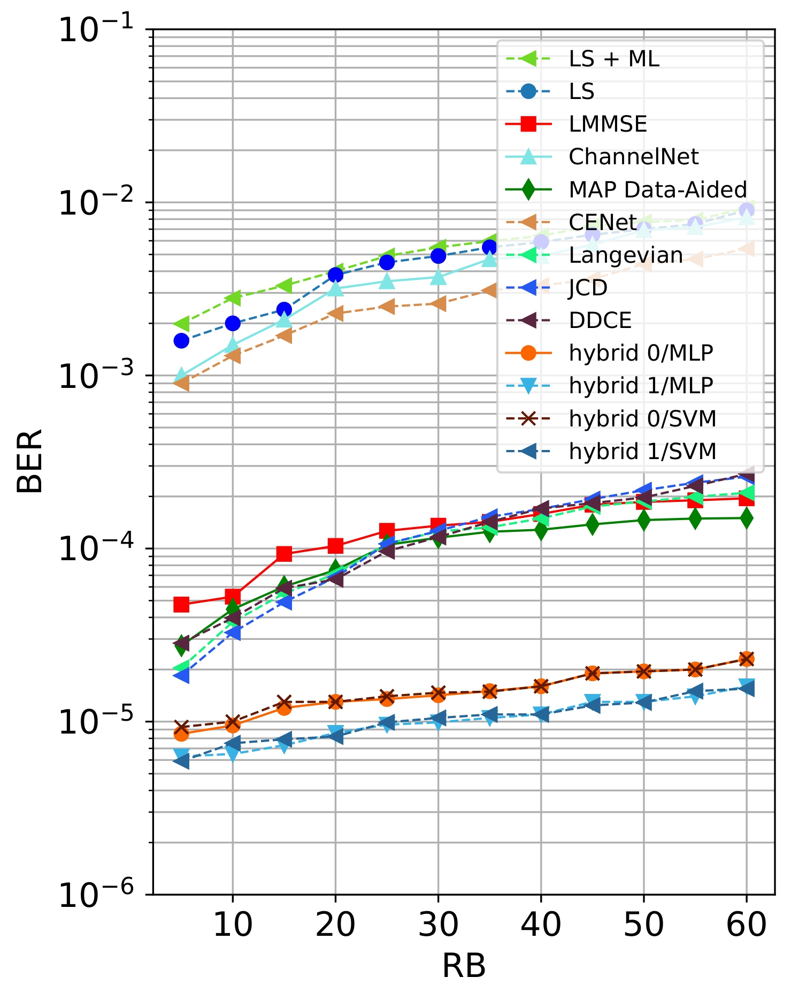
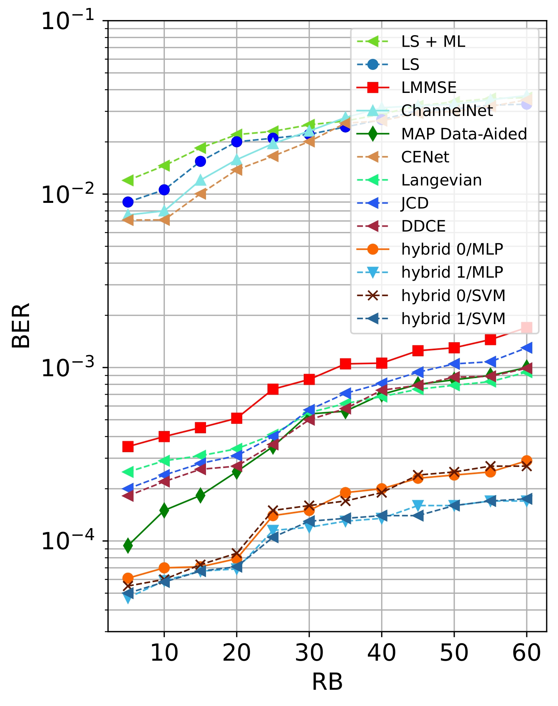
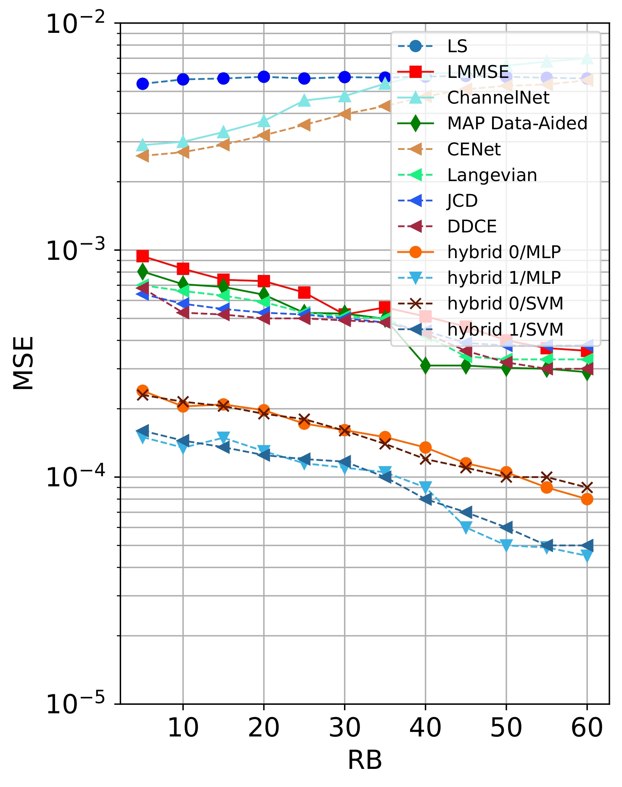
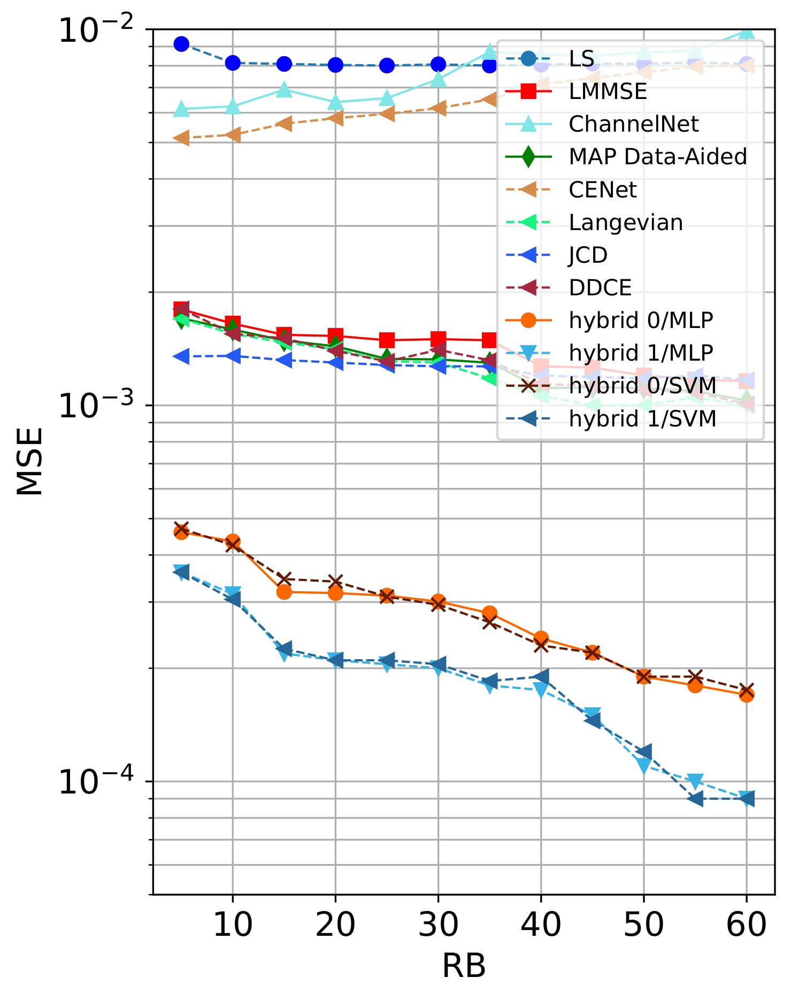

# Opensource Repository for 5G Channel Estimation and Data Detection

<div align="center">
<!-- 
<h2>Deep Learning Based Data-Assisted Channel Estimation and Detection [link]</h2>
-->

[**Hamidreza Hashempoor**](https://hamidreza-hashempoor.github.io/)<sup>1</sup> , [**Wan Choi**](http://wcisl.snu.ac.kr/professor.php)<sup>1&dagger;</sup>.

<sup>1</sup>Seoul National University

&dagger;corresponding author

**TMLCN 2025**


[](https://pyro.ai/)
[](https://www.python.org/downloads/release/python-380/)
[](https://en.wikipedia.org/wiki/MIT_License)

</div>


<div align="center">
  
</div>

This repository provides a general open-source implementation of 5G wireless channel estimation and data detection models in MIMO OFDM framework. It includes conventional baselines, variational approaches, and data-aided methods along with the core idea of the paper _Deep Learning Based Data-Assisted Channel Estimation and Detection_ [[paper link](https://ieeexplore.ieee.org/document/10960353)]. With user-defined configuration of MIMO systems, this framework offers an accessible and flexible foundation for researchers to build upon.

<!--
<div align="center">

https://user-images.githubusercontent.com/2175271/136857714-1d2c8706-7f2f-449d-818f-0e67fbb75400.mp4

</div>
-->


## Framework




## Requirements

Python 3.8 or later with all ```requirements.txt``` dependencies installed. To install run:
```bash
$ pip install -r requirements.txt
```

## Code
### Data Preparation
To generate channel.mat please use MATLAB. Check [here](https://www.etsi.org/deliver/etsi_tr/138900_138999/138900/14.02.00_60/tr_138900v140200p.pdf) for more details. 

### Command-line Arguments
| Argument         | Type     | Default        | Description                                                                 |
|------------------|----------|----------------|-----------------------------------------------------------------------------|
| `--datadir`      | `str`    | ‍‍‍‍`'./channel.mat'` | Path to the channel data.                                                   |
| `--hyp`          | `str`    | `'hyp/hyp.scratch.yaml'` | Path to the hyper parameters.                                                   |
| `--ues`          | `int`    | `2`            | Number of UEs                                                               |
| `--bss`          | `int`    | `4`            | Number of BSs                                                               |
| `--zdim`         | `int`    | `20`           | Latent variable dimension                                                   |
| `--cp`           | `int`    | `30`           | Cyclic prefix len                          |
| `--subcarriers`  | `int`    | `256`          | Subcariers should be 128-256                            |
| `--ltap`         | `int`    | `12`           | Number of TDL channel taps                            |
| `--snrlist`      | `list`   | `[-15, -10, -5, 0, 5, 10]` | SNR list in experiments                            |
| `--timesamplelist`| `list`  | `[2, 4, 5, 10]`| Pilot insertion intervals                            |
| `--ofdmsymbols`  | `int`    | `21`           | Number of OFDM symbols (or time slots `T`)                                 |
| `--modscheme`    | `str`    | `QAM`          | Modulation scheme                                  |
| `--repetition`   | `int`    | `1`            | Uses repetition coding if set `>1`                                          |
| `--num-epochs`   | `int`    | `50`           | Epochs                                          |
| `--esp`          | `int`    | `100`          | Early stop                                          |
| `--lr`           | `int`    | `1.0e-4`       | Learning rate                                          |
| `--save-dir  `   | `str`    | `""`             | Saving directory                                     |
| `--name`         | `str`    | `'exp'`          | Add the name of current seed       |
| `--project`      | `str`    | `'runs'`         | Add the name of project       |


### Experiments
If you want run the experiments, you can directly run the ``main.py``. Each experiment config is commented in the `main` function as follow:
* CONVENTIONAL_CONFIG
* CONV_DATA_AIDED_CONFIG
* CHANNEL_TRACKING
* TORCH_DATA_AIDED
  
  - **Train example**:
```
python --datadir "/channel.mat" --hyp "hyp/hyp.scratch.yaml" --name "seed-0" --project "runs"
```
After running the code, results will be saved in `runs/seed-0` folder and the models are saved at the working directory.

### Results
To achieve results in the paper add convolutional coding scheme. Check [these](https://www.mathworks.com/help/comm/ref/convenc.html) examples. 

* BER-SNR and MSE-SNR for 16 and 64 QAM

<p align="center">
  
  
  
  
</p>

* BER-RB and MSE-RB for 16 and 64 QAM

<p align="center">
  
  
  
  
</p>

## Fancy plots
If you're interested in the plots used in the manuscripts, we've included code snippets to help you generate similar ones.
Please refer to the `plotMAIN.ipynb` and `plotRB.ipynb` notebooks in the `fancy_plot` folder.

## Contribution
All contributions, bug reports, bug fixes, documentation improvements, enhancements, and ideas are welcome. If you believe there is a feature missing, feel free to raise a feature request. To learn more on how to contribute, see the Contributor Guide.

## License
Distributed under the terms of the MIT license, socceraction is free and open source software. Although not strictly required, we appreciate it if you include a link to this repo or cite our research in your work if you make use of socceraction.

## Research and Citation
If you make use of this repository in your research or find it useful, please consider citing it: 
```
@ARTICLE{10960353,
  author={Hashempoor, Hamidreza and Choi, Wan},
  journal={IEEE Transactions on Machine Learning in Communications and Networking}, 
  title={Deep Learning-Based Data-Assisted Channel Estimation and Detection}, 
  year={2025},
  volume={3},
  number={},
  pages={534-551},
  keywords={Channel estimation;Symbols;Noise reduction;Training;Iterative methods;Estimation;Artificial neural networks;Accuracy;Iterative decoding;Deep learning;Channel estimation;deep neural networks (DNNs);variational inference},
  doi={10.1109/TMLCN.2025.3559472}
}
```
