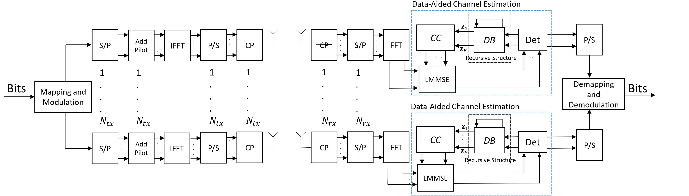

# Deep Learning Based Data-Assisted Channel Estimation and Detection
This repository contains the code for the paper _Deep Learning Based Data-Assisted Channel Estimation and Detection_

## Framework




## Requirements

Python 3.8 or later with all ```requirements.txt``` dependencies installed. To install run:
```bash
$ pip install -r requirements.txt
```

## Code
### Data Preparation
To generate channel.mat please use MATLAB. Check [here](https://www.etsi.org/deliver/etsi_tr/138900_138999/138900/14.02.00_60/tr_138900v140200p.pdf) for more details. 

### Command-line Arguments
| Argument         | Type     | Default        | Description                                                                 |
|------------------|----------|----------------|-----------------------------------------------------------------------------|
| `--datadir`      | `str`    | **(required)** | Path to the channel data.                                                   |
| `--hyp`          | `str`    | `"hyp/hyp.scratch.yaml"` | Path to the hyper parameters.                                                   |
| `--ues`          | `int`    | `2`            | Number of UEs                                                               |
| `--bss`          | `int`    | `4`            | Number of BSs                                                               |
| `--zdim`         | `int`    | `20`           | Latent variable dimension                                                   |
| `--datadir`      | `str`    | **(required)** | Path to the channel data.                                                   |
| `--cp`           | `int`    | `30`           | Cyclic prefix len.                            |
| `--subcarriers`  | `int`    | `256`          | Subcariers should be 128-256.                            |
| `--ltap`         | `int`    | `12`           | Number of TDL channel taps.                            |
| `--snrlist`      | `list`   | `[  -15, -10, -5, 0, 5,10]` | SNR list in experiments.                            |
| `--timesamplelist`| `list`  | `[  2, 4, 5,10]`| Pilot insertion intervals.                            |
| `--ofdmsymbols`  | `int`    | `21`           | Number of OFDM symbols (or time slots `T`).                                 |
| `--modscheme`    | `str`    | `QAM`          | Modulation scheme.                                  |
| `--repetition`   | `int`    | `1`            | Uses repetition coding if set `>1`                                          |
| `--num-epochs`   | `int`    | `50`           | Epochs                                          |
| `--esp`          | `int`    | `100`          | Early stop                                          |
| `--lr`           | `int`    | `1.0e-4`       | Learning rate                                          |
| `--save-dir  `   | `str`    | `""`             | Saving directory.                                     |
| `--name`         | `str`    | `'exp'`          | Add the name of current seed.       |
| `--project`      | `str`    | `'runs'`         | Add the name of project.       |


For simplicity, we are calling data generation modules in the ``main_script`` so can skip the data generation section.
Data generation `.py` files for single pendulum, double pendulum and irregular polygon experiments:

>   * project dir
>     * double pendulum image imputation
>       * `DoublePendulum.py`
>     * double pendulum state estimation
>       * `DoublePendulum.py`
>     * pendulum image imputation
>       * `PendulumData.py`
>     * pendulum state estimation
>       * `PendulumData.py`
>     * polybox image imputation
>       * PolyboxData.py
>       * PymunkData.py
>     * polybox state estimation
>       * PolyboxData.py
>       * PymunkData.py


### Experiments
If you just want run the experiments, you can directly run the ``main_script`` of each experiment as follow:
* double_pendulum image imputation
 ```
cd double pendulum image imputation
python double_pendulum_image_imputation.py --config config0.json
cd ..
```
After running the code, dataset will be generated in `double pendulum image imputation/data` folder and the results are saved at 
`double pendulum image imputation/results`

* double pendulum state estimation
 ```
cd double pendulum state estimation
python double_pendulum_state_estimation.py --config config0.json
cd ..
```
After running the code, dataset will be generated in `double pendulum state estimation/data` folder and the results are saved at 
`double pendulum state estimation/results`

* pendulum image imputation
 ```
cd pendulum image imputation
python pendulum_image_imputation.py --config config.json
cd ..
```
After running the code, dataset will be generated in `pendulum image imputation/data` folder and the results are saved at 
`pendulum image imputation/results`

* pendulum state estimation
 ```
cd pendulum state estimation
python pendulum_state_estimation.py --config config.json
cd ..
```
After running the code, dataset will be generated in `pendulum state estimation/data` folder and the results are saved at 
`pendulum state estimation/results`

* polybox image imputation
 ```
cd polybox image imputation
python polybox_image_imputation.py --config config.json
cd ..
```
After running the code, dataset will be generated in `polybox image imputation/data` folder and the results are saved at 
`polybox image imputation/results`

* polybox state estimation
 ```polybox_state_estimation.py
cd polybox state estimation
python polybox_state_estimation.py --config config.json
cd ..
```
After running the code, dataset will be generated in `polybox state estimation/data` folder and the results are saved at 
`polybox state estimation/results`
